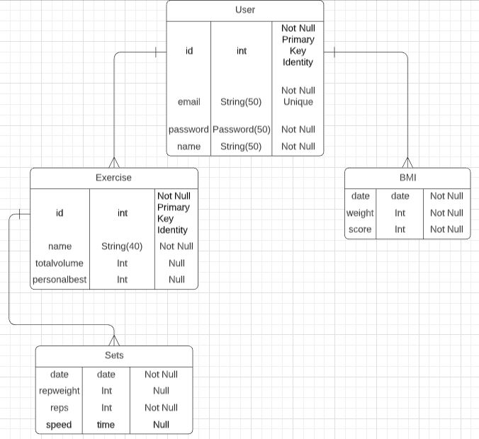

# Fitness Tracker Database

## Physical Database Design



## Database Implementation (SQL Script)

## Drop and Create Database
```
USE master

-- Drop Database
IF DB_ID(N'Fitness') IS NOT NULL DROP DATABASE Fitness;

-- If database could not be created due to open connections, abortIF @@ERROR = 3702    RAISERROR(N'Database cannot be dropped because there are still open connections.', 127, 127) WITH NOWAIT, LOG;

-- Create database
CREATE DATABASE Fitness; 
GO

USE Fitness;
GO

-- Create Schemas
CREATE SCHEMA App AUTHORIZATION dbo;
GO
```

## Create Database Tables
```
-- Create Tables
CREATE TABLE App.Users
(userid          INT          NOT NULL IDENTITY(1,1),  
 email           NVARCHAR(50) NOT NULL Unique,  
 name            NVARCHAR(50) NOT NULL,  
 password        NVARCHAR(60) NOT NULL,  
 
 CONSTRAINT PK_Users PRIMARY KEY(userid)
);

CREATE TABLE App.Exercises
(exid            INT          NOT NULL IDENTITY(1,1),
 userid          INT          NOT NULL,  
 name            NVARCHAR(50) NOT NULL,  
 date            Date         NOT NULL,  
 reps            INT          NOT NULL,  
 repweight       INT          NOT NULL,  
 
 CONSTRAINT PK_Exercises PRIMARY KEY(exid),  
 CONSTRAINT FK_Exercises FOREIGN KEY(userid)    
    REFERENCES App.Users(userid)
);

CREATE TABLE App.Bmi
(userid            INT          NOT NULL,  
 date              Date         NOT NULL,  
 weight            INT          NOT NULL,  
 height            INT          NOT NULL,  
 score             INT          NULL,  
 
 CONSTRAINT FK_Bmi FOREIGN KEY(userid)    
    REFERENCES App.Users(userid)
);
```

## Populate Database Tables
```
-- Populate table App.Users
INSERT INTO App.Users(email, name, password)
    VALUES( N'person1@abc.com', N'Sara', N'password');
INSERT INTO App.Users(email, name, password)  
VALUES( N'person2@abc.com', N'Travis', N'password');

SELECT *
FROM App.Users;

-- Populate table App.Exercises
INSERT INTO App.Exercises(userid, name, date, reps, repweight)  
VALUES( 1, N'Squats', '2020-01-01', 50, 45);
INSERT INTO App.Exercises(userid, name, date, reps, repweight)  
VALUES( 1, N'Benchpress', '2020-01-05', 4, 45);
INSERT INTO App.Exercises(userid, name, date, reps, repweight)  
VALUES( 1, N'Shoulderpress', '2020-01-02', 20, 25);
INSERT INTO App.Exercises(userid, name, date, reps, repweight)  
VALUES( 2, N'Benchpress', '2020-01-05', 30, 115);
INSERT INTO App.Exercises(userid, name, date, reps, repweight)  
VALUES( 2, N'Squats', '2020-01-01', 60, 205);
INSERT INTO App.Exercises(userid, name, date, reps, repweight)  
VALUES( 2, N'Benchpress', '2020-01-06', 30, 185);

SELECT *
FROM App.Exercises;

-- Populate table App.Bmi
INSERT INTO App.Bmi(userid, date, weight, height, score)  
VALUES( 1, '2020-01-01', 150, 62, NULL);
INSERT INTO App.Bmi(userid, date, weight, height, score)  
VALUES( 2, '2020-01-05', 200, 72, NULL);
INSERT INTO App.Bmi(userid, date, weight, height, score)  
VALUES( 1, '2020-01-20', 155, 62, NULL);
INSERT INTO App.Bmi(userid, date, weight, height, score)  
VALUES( 2, '2020-01-22', 190, 72, NULL);

SELECT *
FROM App.Bmi;
```
